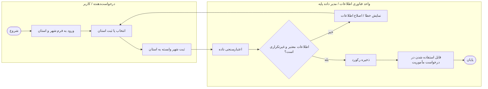
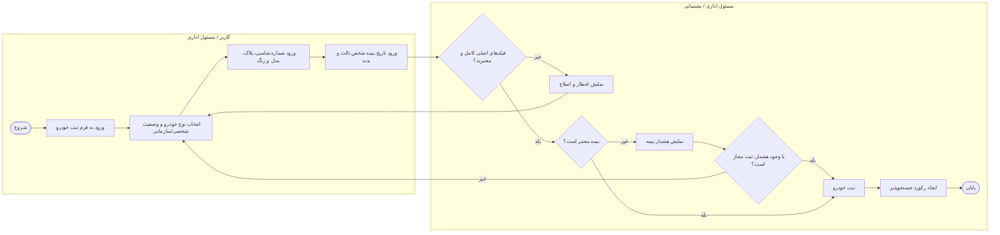
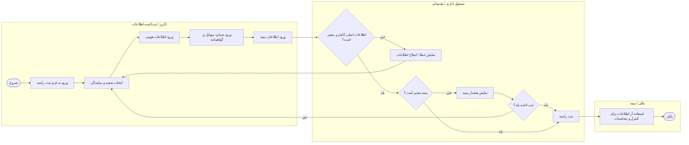
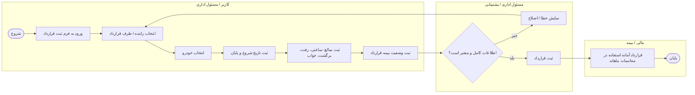
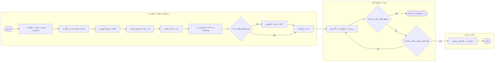
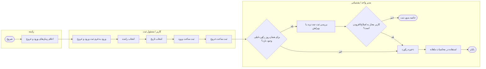
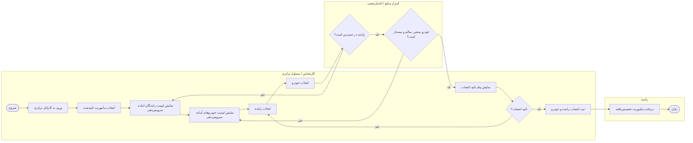
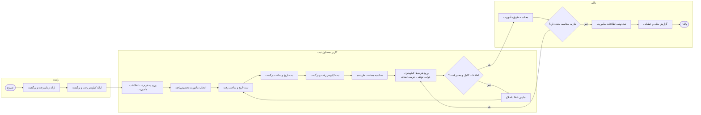
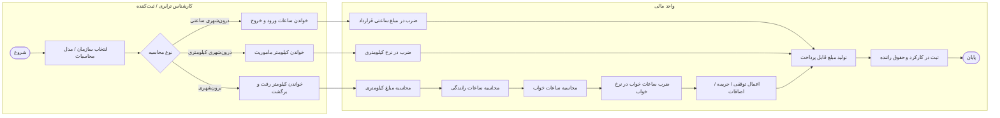

# Mermaid Role-Based User Flows — سامانه ترابری و احکام مأموریت

> نکته: در Mermaid، نمایش lane رسمی مثل BPMN وجود ندارد؛ برای نمایش نقش‌ها از `subgraph` به‌عنوان معادل swimlane استفاده شده است.

---

## 1) User Flow اصلی سامانه — Role Based

```mermaid
flowchart LR

    subgraph U1[کاربر / درخواست‌دهنده]
        A([شروع])
        H[ثبت درخواست مأموریت]
    end

    subgraph M1[مدیران / سطوح تأیید]
        I[بررسی در گردش تأیید]
        J{همه سطوح تأیید کردند؟}
        K([رد درخواست و خاتمه])
    end

    subgraph T1[کارشناس / مسئول ترابری]
        B{پیش‌نیازها آماده است؟}
        C[ثبت شعب]
        D[ثبت شهر و استان]
        E[ثبت خودرو]
        F[ثبت راننده]
        G[ثبت قرارداد]
        L[دریافت در کارتابل ترابری]
        M[انتخاب راننده و انتصاب خودرو]
        N{راننده و خودرو معتبر و در دسترس هستند؟}
        O[اعزام و انجام مأموریت]
        Q[ثبت ورود و خروج راننده]
        R[ثبت اطلاعات و کیلومتر مأموریت]
    end

    subgraph F1[مالی / محاسبات]
        S[محاسبه حقوق و هزینه مأموریت]
        T{مدل محاسبات خاص سازمان فعال است؟}
        U[اعمال قواعد محاسبات سایر سازمان‌ها]
        V[ثبت نهایی و گزارش‌گیری]
        W([پایان])
    end

    A --> B
    B -- خیر --> C --> D --> E --> F --> G --> H
    B -- بله --> H
    H --> I --> J
    J -- خیر --> K
    J -- بله --> L --> M --> N
    N -- خیر --> M
    N -- بله --> O
    O --> P{نوع مأموریت}
    P -- درون‌شهری ساعتی --> Q --> R
    P -- سایر --> R
    R --> S --> T
    T -- بله --> U --> V --> W
    T -- خیر --> V --> W
```

---

## 2) فرآیند ثبت شهر و استان — Role Based

---

## 3) فرآیند ثبت خودرو — Role Based

---

## 4) فرآیند ثبت راننده — Role Based

---

## 5) فرآیند ثبت قرارداد — Role Based

---

## 6) فرآیند درخواست مأموریت — Role Based

---

## 7) فرآیند ثبت ورود و خروج راننده — Role Based

---

## 8) فرآیند انتخاب راننده و انتصاب خودرو به مأموریت — Role Based

---

## 9) فرآیند ثبت اطلاعات و کیلومتر مأموریت — Role Based

---

## 10) فرآیند محاسبات سایر سازمان‌ها — Role Based

