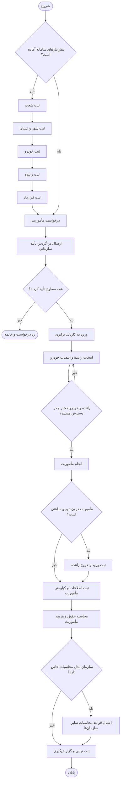
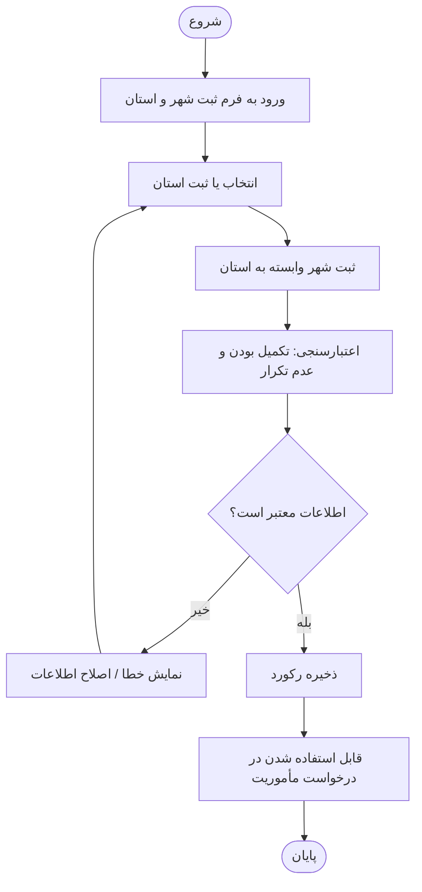
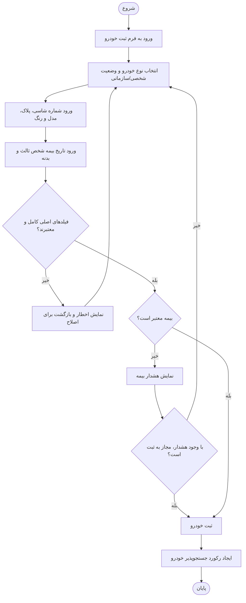
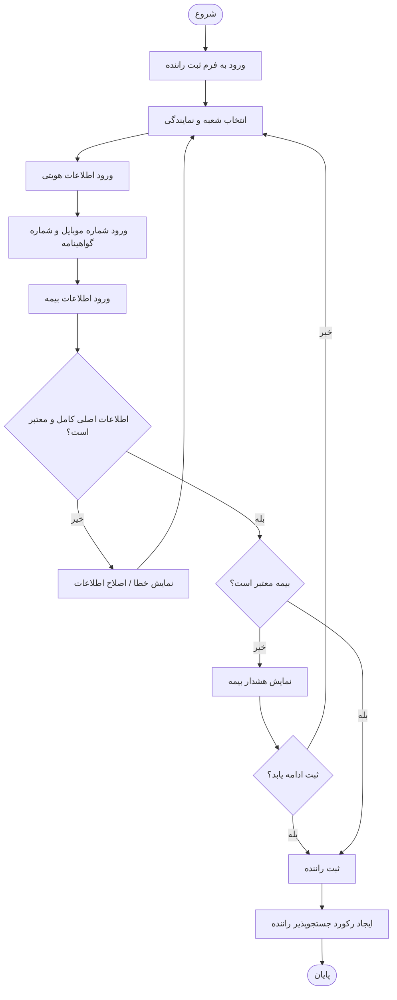
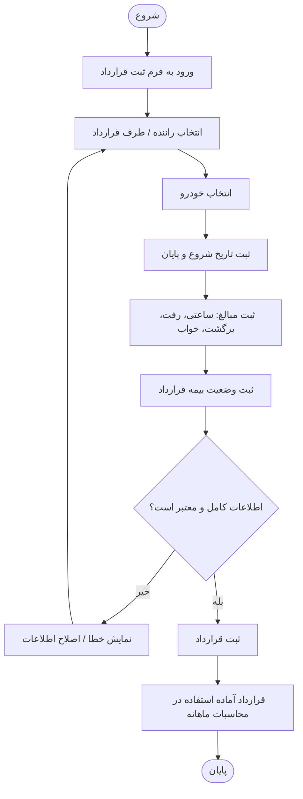
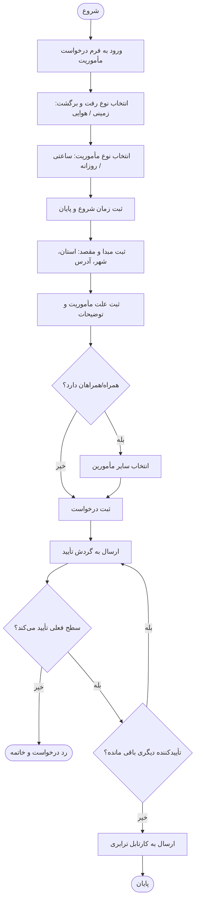
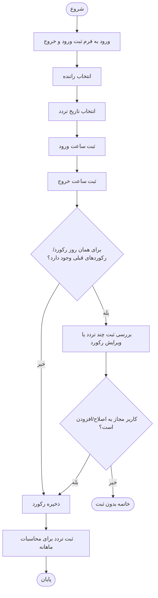
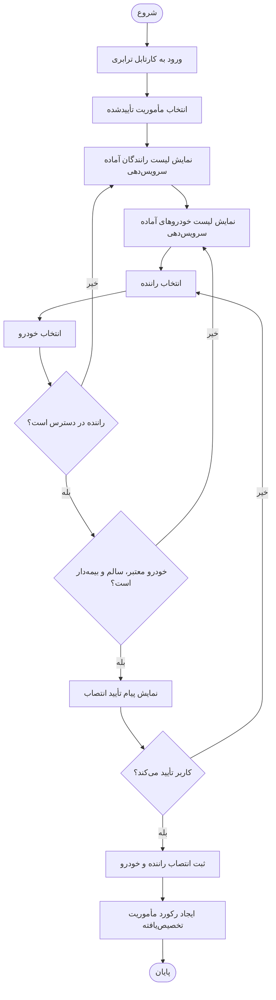
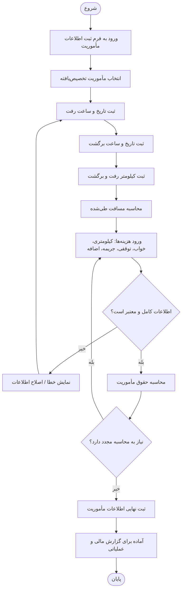
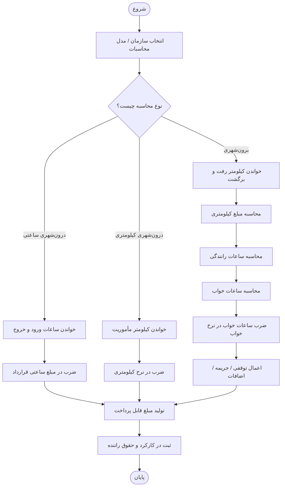

# Mermaid User Flows — سامانه ترابری و احکام مأموریت

## 1) User Flow اصلی سامانه

---

## 2) فرآیند ثبت شهر و استان

---

## 3) فرآیند ثبت خودرو

---

## 4) فرآیند ثبت راننده

---

## 5) فرآیند ثبت قرارداد

---

## 6) فرآیند درخواست مأموریت

---

## 7) فرآیند ثبت ورود و خروج راننده

---

## 8) فرآیند انتخاب راننده و انتصاب خودرو به مأموریت

---

## 9) فرآیند ثبت اطلاعات و کیلومتر مأموریت

---

## 10) فرآیند محاسبات سایر سازمان‌ها (الگوی توسعه‌پذیر)

