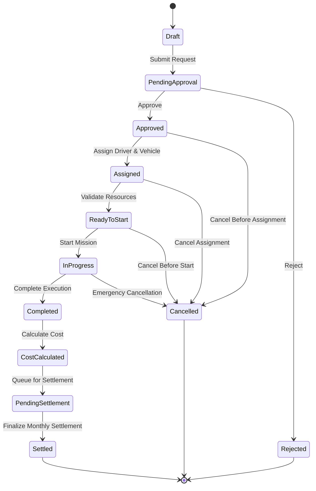

# State Machine — Transport & Mission Management System

## Purpose
This document defines the lifecycle state transitions for missions and related process checkpoints.

## 1. Mission State Lifecycle
Current baseline lifecycle:

`Draft -> PendingApproval -> Approved -> Rejected -> Assigned -> ReadyToStart -> InProgress -> Completed -> CostCalculated -> PendingSettlement -> Settled -> Cancelled`

## 2. Mermaid State Diagram

## 3. Transition Rules
- `Draft -> PendingApproval`: only requester or admin can submit.
- `PendingApproval -> Approved/Rejected`: only authorized approvers.
- `Approved -> Assigned`: only dispatcher/admin after availability and insurance checks.
- `Assigned -> ReadyToStart`: resource confirmation completed.
- `ReadyToStart -> InProgress`: execution start recorded.
- `InProgress -> Completed`: end time and mileage recorded.
- `Completed -> CostCalculated`: finance engine calculation completed.
- `CostCalculated -> PendingSettlement`: cost stored and queued.
- `PendingSettlement -> Settled`: monthly settlement approved/finalized.

## 4. Guard Conditions
- Rejected missions cannot be dispatched.
- Cancelled missions cannot be executed.
- Settled missions cannot be edited financially.
- Missions in `InProgress` cannot be reassigned without a compensating process.
- Assignment requires mission status = `Approved`.
- Completion requires entry/exit and mileage data according to current policy.

## 5. Configurable / TODO Areas
- Whether `ReadyToStart` is mandatory or can be skipped
- Whether finance approval should create an intermediate `FinanceApproved` state
- Whether `Cancelled` after `InProgress` should branch to `ClosedWithException`
