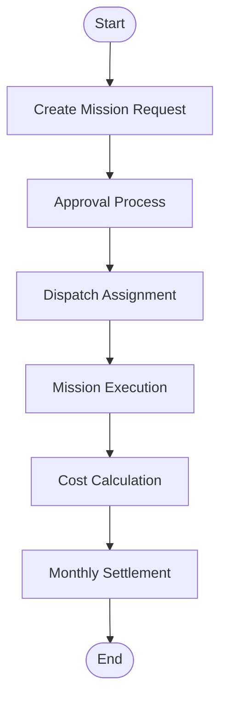
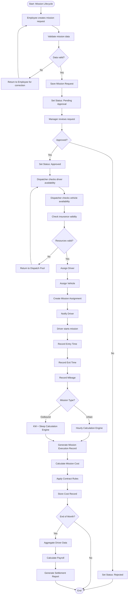
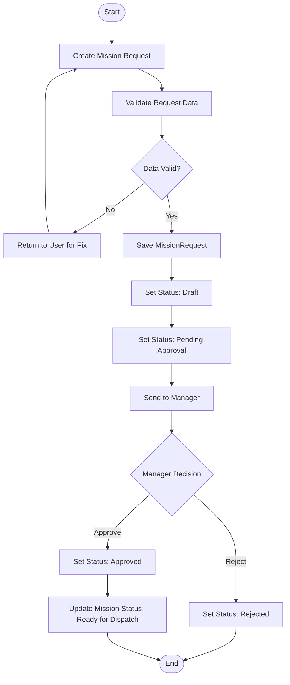
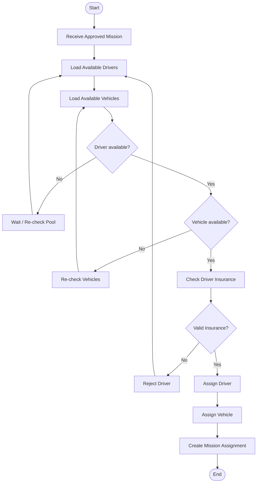
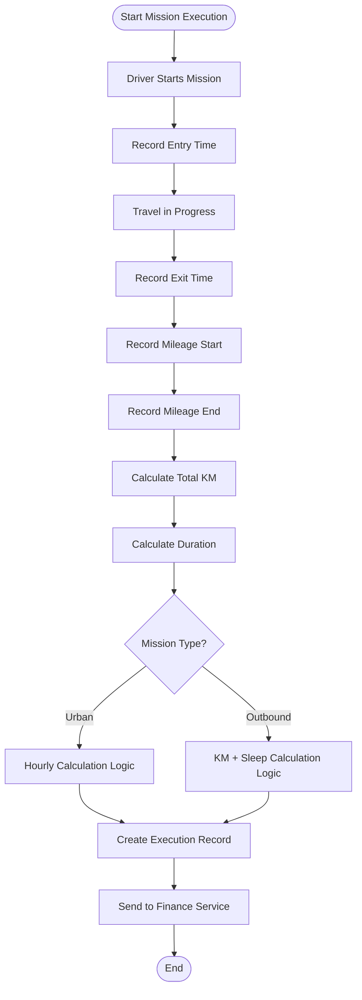
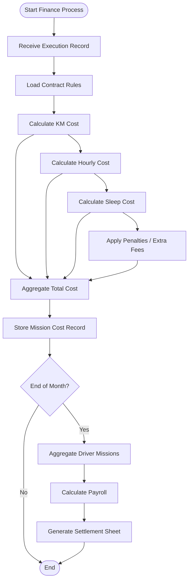

# BPMN — Mission Lifecycle

## Purpose
This document provides BPMN-like executable flow definitions in Mermaid for implementation planning.

## 1. Level 1 — High-Level Mission Lifecycle

## 2. Level 2 — Executable Mission Lifecycle

## 3. Service-Level BPMN — Mission Core

## 4. Service-Level BPMN — Dispatch

## 5. Service-Level BPMN — Execution

## 6. Service-Level BPMN — Finance

## 7. Open Questions / TODO
- Air travel specifics
- Multi-step approval across organizational hierarchy
- Special organization-specific finance flows
