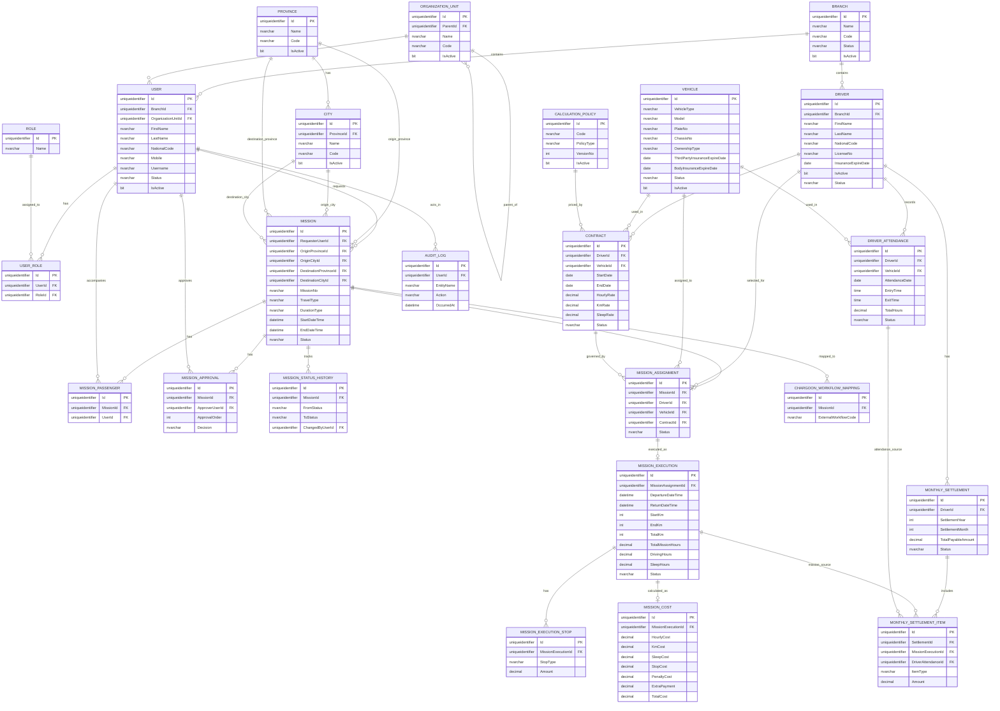

# ERD — Transport & Mission Management System

## Purpose
This document provides an implementation-oriented ERD summary for Codex, complementing the detailed `database-schema.md` and `schema.sql`.

## 1. Main Entity Groups
- Identity & Organization
- Master Data / Geography
- Fleet
- Contracts & Policies
- Missions & Approvals
- Dispatch & Execution
- Finance & Settlement
- Audit & Integration

## 2. Mermaid ERD

## 3. Implementation Notes
- Detailed field definitions live in `docs/database-schema.md`
- Actual DDL lives in `database/schema.sql`
- Some relationship/cardinality assumptions remain configurable due to incomplete RFB areas

## 4. Open Questions / TODO
- Whether mission request and mission should be separated further
- Exact Chargoon workflow persistence requirements
- Whether representation must become its own entity
