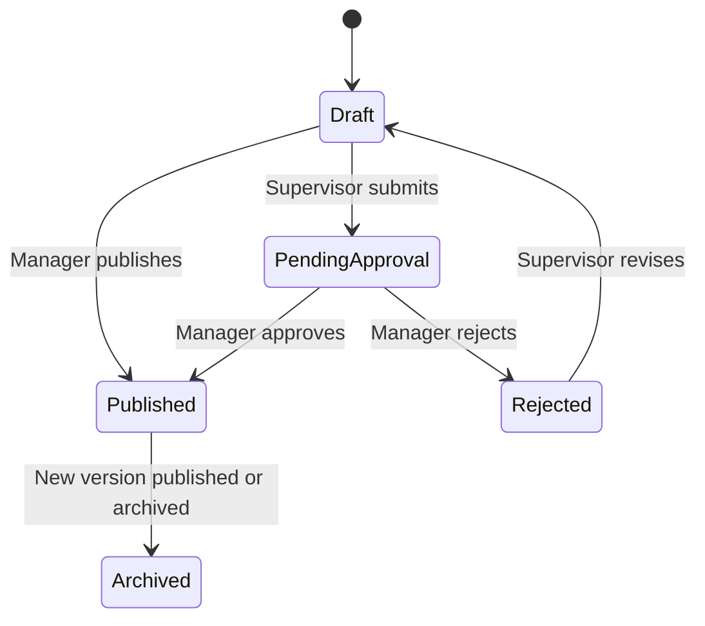
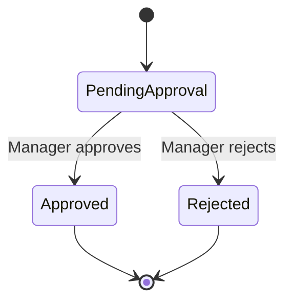
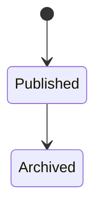

# State Model

## KnowledgeVersion Status

```mermaid
stateDiagram-v2
    [*] --> Draft
    Draft --> PendingApproval: Supervisor submits
    Draft --> Published: Manager publishes
    PendingApproval --> Published: Manager approves
    PendingApproval --> Rejected: Manager rejects
    Published --> Archived: New version published or archived
    Rejected --> Draft: Supervisor revises
```

## EditRequest Status

```mermaid
stateDiagram-v2
    [*] --> PendingApproval
    PendingApproval --> Approved: Manager approves
    PendingApproval --> Rejected: Manager rejects
    Approved --> [*]
    Rejected --> [*]
```

## DailyMessage Status

```mermaid
stateDiagram-v2
    [*] --> Published
    Published --> Archived
```
