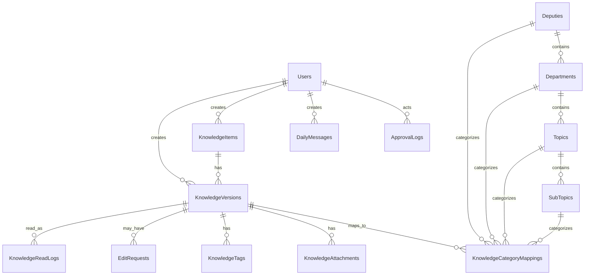

# ERD Overview

```mermaid
erDiagram
    Users ||--o{ KnowledgeItems : creates
    Users ||--o{ KnowledgeVersions : creates
    KnowledgeItems ||--o{ KnowledgeVersions : has
    KnowledgeVersions ||--o{ KnowledgeAttachments : has
    KnowledgeVersions ||--o{ KnowledgeCategoryMappings : maps_to
    KnowledgeVersions ||--o{ KnowledgeTags : has
    KnowledgeVersions ||--o{ EditRequests : may_have
    KnowledgeVersions ||--o{ KnowledgeReadLogs : read_as

    Deputies ||--o{ Departments : contains
    Departments ||--o{ Topics : contains
    Topics ||--o{ SubTopics : contains

    Deputies ||--o{ KnowledgeCategoryMappings : categorizes
    Departments ||--o{ KnowledgeCategoryMappings : categorizes
    Topics ||--o{ KnowledgeCategoryMappings : categorizes
    SubTopics ||--o{ KnowledgeCategoryMappings : categorizes

    Users ||--o{ DailyMessages : creates
    Users ||--o{ ApprovalLogs : acts
```
